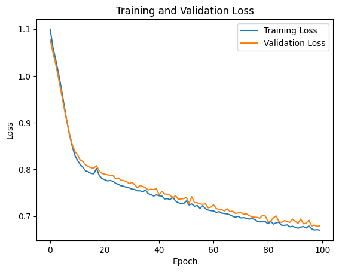
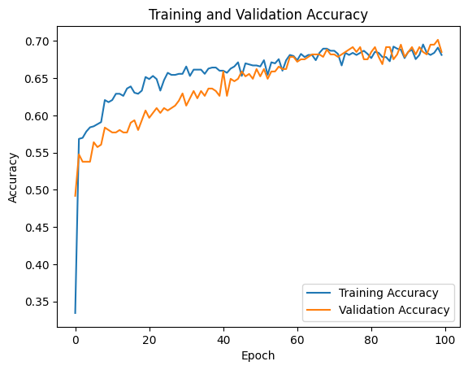
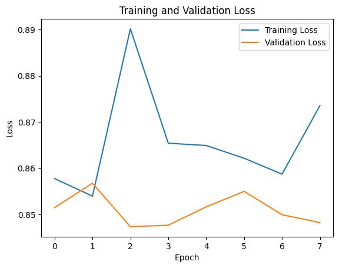
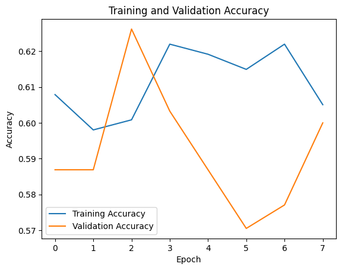
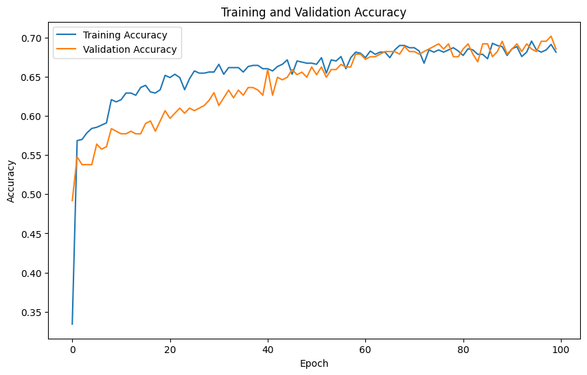
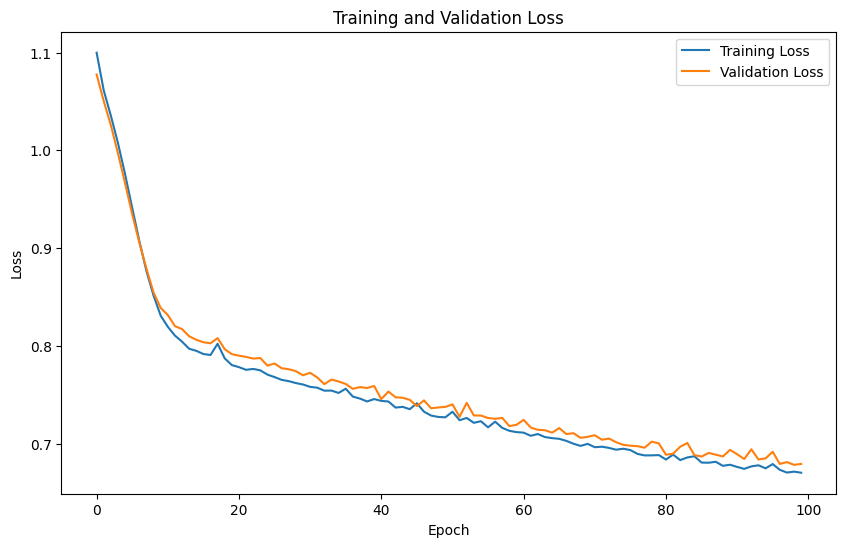

# Maternal Health Monitoring System (CTRL)

## Introduction and Motivation
Maternal mortality remains a critical issue in the African Region, where it accounted for 69% of global maternal deaths in 2020. Despite global improvements, the maternal mortality ratio (M.M.R.) in Africa remains alarmingly high due to factors such as inadequate healthcare access, delayed interventions, and insufficient skilled personnel. This project aims to address these challenges by developing an innovative maternal health monitoring system using IoT, machine learning (ML), and mobile technology.

## Problem Statement
Traditional prenatal care methods often fail to detect life-threatening complications early enough, contributing to high maternal mortality rates in Africa. Limited access to quality healthcare services and a shortage of skilled professionals further exacerbate the problem. This project seeks to mitigate these issues through continuous monitoring, early risk detection, and personalized healthcare recommendations.

## Project Objectives
- `Design and develop an IoT wearable:` Monitor vital signs (blood pressure, heart rate, etc.) and fetal health parameters continuously.
- `Implement machine learning algorithms: `Analyze real-time data for early detection of complications like preeclampsia and gestational diabetes.
- `Develop a mobile application: `Provide real-time health monitoring, personalized advice, and educational resources for expectant mothers.
- `Integrate with healthcare provider interface`: Enable remote monitoring and timely intervention for high-risk cases.
- `Ensure data security and privacy:` Implement robust measures to protect patient data and integrate with existing healthcare systems.

## Technical Requirements

### IoT Wearable Device Development
- Hardware Components: Microcontroller (e.g., Arduino, ESP32), sensors (heart rate, blood pressure, SpO2, thermometer), communication modules (BLE, Wi-Fi/GSM/LTE).
- Data Management: Cloud-based databases (Amazon RDS, Google Cloud Firestore), edge computing for data preprocessing.

### Machine Learning Algorithms and Models
- Data Analysis: Time series analysis, classification algorithms (Random Forest, SVM), deep learning models (LSTM, GRU) for predictive analytics.
- Model Deployment: TensorFlow, PyTorch for training; AWS SageMaker, TensorFlow Lite for deployment.

### Mobile Application Development
- Framework: Flutter for cross-platform development (iOS and Android).
- Features: Real-time monitoring, personalized recommendations, notifications, educational resources, telehealth integration.
- Backend Integration: RESTful APIs, GraphQL for communication, data security (TLS, OAuth2.0).

### Data Privacy and Security
- Encryption: End-to-end encryption (AES-256) for data transmission and at rest.
- Access Control: Role-Based Access Control (RBAC), audit trails for data access and changes.

## About Dataset
### Context

Data has been collected from different hospitals, community clinics, maternal health cares through the IoT based risk monitoring system.

- Age: Age in years when a woman is pregnant.
- SystolicBP: Upper value of Blood Pressure in mmHg, another significant attribute during pregnancy.
- DiastolicBP: Lower value of Blood Pressure in mmHg, another significant attribute during pregnancy.
- BS: Blood glucose levels is in terms of a molar concentration, mmol/L.
- HeartRate: A normal resting heart rate in beats per minute.
- Risk Level: Predicted Risk Intensity Level during pregnancy considering the previous attribute.

## Methodology:
We implemented and compared three models:
1 Basic Neural Network
2 Regularized Neural Network
3 Decision Tree Classifier

### 1 Basic Neural Network:
- We used a simple neural network with 2 hidden layers and 100 neurons in each layer. A sequential model was constructed using TensorFlow and Keras.

## Model summary
Model: "sequential"

Model Architecture

The model consists of the following layers:

    Input Layer
        Shape: Defined implicitly by the input shape of the first dense layer.

    First Hidden Layer
        Type: Dense
        Number of Neurons: 32
        Activation Function: ReLU
        Output Shape: (None, 32)
        Number of Parameters: 224

    Second Hidden Layer
        Type: Dense
        Number of Neurons: 16
        Activation Function: ReLU
        Output Shape: (None, 16)
        Number of Parameters: 528

    Output Layer
        Type: Dense
        Number of Neurons: 3
        Activation Function: Softmax
        Output Shape: (None, 3)
        Number of Parameters: 51

## Model accuracy
Loss: 0.6791562438011169, Accuracy: 0.685245931148529

At the end of the training process, the model achieved an accuracy of 68.5%. The model was then evaluated on the test dataset to assess its performance on unseen data.

## Model 2 ( Regularized Neural Network)
- To improve the generalization and prevent overfitting, we added L2 regularization to the neural network model. This regularization technique penalizes large weights in the network, reducing the complexity of the model. We used a regularization parameter of 0.01 in this model.  For this model we used the L2 regularization and also add in dropout layers coupled with some early stopping in the model training process.

## Model summary
Model Architecture

The model consists of the following layers:

    Input Layer
        Shape: Defined implicitly by the input shape of the first dense layer.

    First Hidden Layer
        Type: Dense
        Number of Neurons: 64
        Activation Function: ReLU (assumed, as activation isn't listed)
        Output Shape: (None, 64)
        Number of Parameters: 448

    Dropout Layer 1
        Type: Dropout
        Dropout Rate: Defined implicitly (assumed common default)
        Output Shape: (None, 64)
        Number of Parameters: 0

    Second Hidden Layer
        Type: Dense
        Number of Neurons: 32
        Activation Function: ReLU (assumed, as activation isn't listed)
        Output Shape: (None, 32)
        Number of Parameters: 2,080

    Dropout Layer 2
        Type: Dropout
        Dropout Rate: Defined implicitly (assumed common default)
        Output Shape: (None, 32)
        Number of Parameters: 0

    Third Hidden Layer
        Type: Dense
        Number of Neurons: 16
        Activation Function: ReLU (assumed, as activation isn't listed)
        Output Shape: (None, 16)
        Number of Parameters: 528

    Dropout Layer 3
        Type: Dropout
        Dropout Rate: Defined implicitly (assumed common default)
        Output Shape: (None, 16)
        Number of Parameters: 0

    Output Layer
        Type: Dense
        Number of Neurons: 3
        Activation Function: Softmax
        Output Shape: (None, 3)
        Number of Parameters: 51

## Model accuracy
Using the regularized model, the model achieved an accuracy of 68.6%. The regularization technique helped improve the model's generalization and prevent overfitting.

## Model 3 (Decision Tree Classifier)
- We used the Decision Tree Classifier model to build a model that predicts the risk level of the patient. The model was built using the training dataset. We used the default parameters in this model. A decision tree model was implemented using scikit-learn, optimized through GridSearchCV.

## Model summary
'criterion': 'entropy', 'max_depth': None, 'min_samples_leaf': 1, 'min_samples_split': 2}
0.8419638397762462

## Model accuracy
Using the Decision Tree Classifier model, the model achieved an accuracy of 80%.

## Model Performance Comparison
### Model 1 (Basic Neural Network)

Trainning and validation loss are shown below:

Training and validation accuracy are shown below:

### Model 2 (Regularized Neural Network)

Trainning and validation loss are shown below:

Trinning and validation accuracy are shown below:

### Model 3 (Decision Tree Classifier)

Trainning and validation loss are shown below:

Trinning and validation accuracy are shown below:

##  Decision Tree Performance
The Decision Tree Classifier model achieved an accuracy of 80%, outperforming the basic neural network and regularized neural network models. The decision tree model's performance was evaluated on the test dataset, demonstrating its effectiveness in predicting the risk level of patients.

## Discussion
The Decision Tree Classifier outperformed both neural network models, achieving an accuracy of approximately 80% on the test set. This superior performance, coupled with its inherent interpretability, makes it the preferred model for this maternal health risk prediction task.

### Factors contributing to the Decision Tree's success include:
- Ability to capture non-linear relationships without assuming a specific functional form
- Robustness to outliers and minimal need for data preprocessing
- Interpretability of decision rules, crucial in healthcare applications

## Conclusion
Our analysis demonstrates that for this maternal health risk prediction task, a well-tuned Decision Tree Classifier outperforms more complex neural network models. This finding underscores the importance of considering a range of algorithms and not assuming that more complex models will necessarily perform better.
